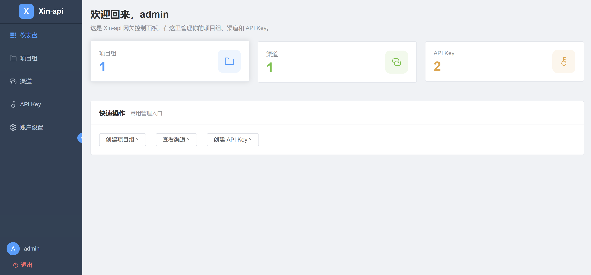

# Xin API 🚀

[中文](./README.md) | English

<p align="center">
  <strong>A high-performance gateway for unified LLM API management, full-link tracing, and smart distribution</strong>
</p>

<p align="center">
  
  
  
  
  
  
  
</p>

---

## ✨ Introduction

Xin API is a high-performance Large Language Model (LLM) gateway service that seamlessly integrates with mainstream models like OpenAI, Anthropic Claude, DeepSeek, and more — providing a standardized, unified API access layer.

### Core Features

- **🎯 Unified API Gateway**: Standardize different LLM APIs under a single `/v1/chat/completions` endpoint
- **🔀 Smart Distribution**: Weight-based load balancing to automatically route requests to the optimal channel
- **🛡️ Circuit Breaker**: Distributed circuit breaker that isolates failing channels and prevents cascading failures
- **⚡ Rate Limiting**: Redis-based distributed rate limiter supporting RPM/TPM multi-dimensional limiting
- **👥 Multi-Tenant Management**: Hierarchical management of users, groups, and channels
- **🔑 API Key Management**: Flexible API key distribution and revocation
- **📊 Full-Link Tracing**: Complete request chain tracing and audit logging (extensible)
- **🌐 Web Admin Dashboard**: Modern management UI built with Vue 3 + Tailwind CSS
- **🐳 Containerized Deployment**: Out-of-the-box Docker Compose deployment

---

## 🏗️ Architecture

### Tech Stack

| Layer | Technology |
|-------|------------|
| **Frontend** | Vue 3 + TypeScript + Vite + Tailwind CSS + Element Plus |
| **Backend** | Go 1.25 + Gin + GORM + JWT |
| **Database** | PostgreSQL 16 (metadata storage) |
| **Cache** | Redis 7 (rate limiting, circuit breaker, sessions) |
| **Proxy** | Nginx (reverse proxy, static assets) |
| **Deployment** | Docker + Docker Compose |

---

## 🚀 Quick Start

### Prerequisites

- Go 1.25+
- Node.js 22+
- PostgreSQL 16+
- Redis 7+
- Docker & Docker Compose (recommended)

### Docker Compose One-Click Deployment (Recommended)

```bash
# 1. Clone the repository
git clone https://github.com/GripAIcn/Xin-api.git
cd Xin-api

# 2. Configure environment variables
cp .env.example .env
# Edit .env to set database password, JWT secret, etc.

# 3. Start services
cd build
./scripts/deploy.sh start

# Or use docker-compose directly
# docker-compose up -d --build

# 4. Access the services
# Web Dashboard: http://localhost
# API Endpoint:  http://localhost/v1
```

### Local Development Setup

#### 1. Start Dependencies

```bash
# Start PostgreSQL and Redis
docker run -d --name xin-postgres \
  -e POSTGRES_PASSWORD=123456 \
  -p 5432:5432 \
  postgres:16-alpine

docker run -d --name xin-redis \
  -e REDIS_PASSWORD=123456 \
  -p 6379:6379 \
  redis:7-alpine
```

#### 2. Start Backend

```bash
# Configure environment
cp .env.example .env

# Install dependencies and run
go mod download
go run cmd/xin_api/main.go
```

#### 3. Start Frontend Dev Server

```bash
cd web
npm install
npm run dev
```

The frontend dev server runs on `http://localhost:5173` by default.

---

## 🔧 Configuration

### Environment Variables

| Variable | Default | Description |
|----------|---------|-------------|
| `PROXY_PORT` | `8080` | Backend service port |
| `NGINX_HTTP_PORT` | `80` | Nginx HTTP port (Docker Compose only) |
| `NGINX_HTTPS_PORT` | `443` | Nginx HTTPS port (Docker Compose only) |
| `GIN_MODE` | `release` | Run mode (debug/release) |
| `LOG_LEVEL` | `info` | Log level |
| `POSTGRES_HOST` | `127.0.0.1` | PostgreSQL host |
| `POSTGRES_USER` | `root` | PostgreSQL username |
| `POSTGRES_PASSWORD` | `123456` | PostgreSQL password |
| `POSTGRES_DB` | `gateway` | PostgreSQL database name |
| `POSTGRES_PORT` | `5432` | PostgreSQL port |
| `REDIS_HOST` | `127.0.0.1` | Redis host |
| `REDIS_PORT` | `6379` | Redis port |
| `REDIS_PASSWORD` | `123456` | Redis password |
| `REDIS_DB` | `0` | Redis database number |
| `REDIS_POOL_SIZE` | `20` | Redis connection pool size |
| `JWT_SECRET` | `123456zbcd+-` | JWT signing secret (must change in production) |
| `JWT_EXPIRE` | `24h` | JWT expiration time |
| `CB_FAILURE_THRESHOLD` | `5` | Circuit breaker failure threshold |
| `CB_RECOVERY_INTERVAL` | `60s` | Circuit breaker recovery interval |
| `PROXY_REQUEST_TIMEOUT` | `180s` | Upstream request timeout |
| `PROXY_MAX_BODY_MB` | `10` | Max request body size (MB) |
| `DEFAULT_RPM` | `60` | Default requests per minute limit (Docker Compose only) |
| `DEFAULT_TPM` | `100000` | Default tokens per minute limit (Docker Compose only) |

---

## 🌐 Live Demo

Try Xin API Admin Dashboard at [http://api.gripai.cn/](http://api.gripai.cn/)

- **Username**: admin
- **Password**: 12345678

---

##  Screenshots

### Dashboard



### Admin Dashboard Features

- **📊 Dashboard**: System overview, request statistics
- **👥 User Management**: User accounts and permissions
- **📁 Group Management**: Create and manage project groups with channels
- **🔌 Channel Management**: Configure upstream LLM channels with weighted routing
- **🔑 API Key Management**: Distribute and manage API keys
- **⚙️ System Settings**: Global configuration

---

## 🐳 Production Deployment

### Docker Compose Deployment

For complete deployment configuration, see [build/README.md](build/README.md)

Deployment directory structure:

```
build/
├── Dockerfile              # Unified multi-stage build (Node.js + Go + Alpine)
├── Dockerfile.nginx        # Nginx reverse proxy configuration
├── docker-compose.yml      # Service orchestration (PostgreSQL + Redis + App + Nginx)
├── .dockerignore          # Docker build ignore file
├── nginx/                 # Nginx configuration files
│   ├── nginx.conf
│   └── default.conf
└── scripts/
    └── deploy.sh          # Deployment script
```

Start command:

```bash
cd build

# One-click start all services
./scripts/deploy.sh start

# Or build and start all services
docker-compose up -d --build

# Check service status
docker-compose ps

# View application logs
docker-compose logs -f app

# Stop services
docker-compose down
```

### Deploy Script Commands

```bash
./scripts/deploy.sh start    # Start all services
./scripts/deploy.sh stop     # Stop all services
./scripts/deploy.sh restart  # Restart all services
./scripts/deploy.sh logs     # View all logs
./scripts/deploy.sh logs app      # View app logs (frontend + backend)
./scripts/deploy.sh logs nginx    # View Nginx logs
./scripts/deploy.sh logs postgres # View database logs
./scripts/deploy.sh logs redis    # View cache logs
./scripts/deploy.sh status   # Check service status
./scripts/deploy.sh build    # Rebuild images
./scripts/deploy.sh health   # Check service health status
./scripts/deploy.sh update   # Update code and restart services
```

### Service Architecture

```
User Request → Nginx (80/443)
    ├── /v1/*  → Backend API Service (app:8080)
    └── /*     → Frontend Static Files (app:8080)

Backend Dependencies: PostgreSQL + Redis
```

### Service Ports

| Service | Container Port | Host Port | Description |
|---------|---------------|-----------|-------------|
| Nginx | 80/443 | 80/443 | Web Entry (Unified) |
| Xin-api | 8080 | - | Backend + Frontend Static Files (Internal) |
| PostgreSQL | 5432 | 5432 | Database |
| Redis | 6379 | 6379 | Cache Service |

### Data Persistence

Data is automatically persisted via Docker Volumes:

- `postgres_data`: PostgreSQL data
- `redis_data`: Redis data
- `nginx_logs`: Nginx logs

### Production Recommendations

1. **Change default passwords**: Update database and Redis passwords
2. **Rotate JWT secret**: Use a strong random string for JWT_SECRET
3. **Enable HTTPS**: Configure Nginx SSL certificates
4. **Configure log rotation**: Prevent logs from filling disk space
5. **Regular backups**: Schedule regular PostgreSQL backups

---

## 📄 License

This project is licensed under the [MIT License](LICENSE).

---

<p align="center">
  <strong>⭐ If you find this project helpful, please give it a Star!</strong>
</p>
